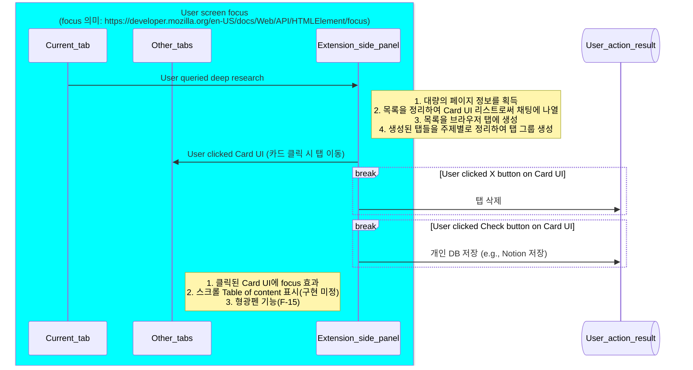

# 지식노동자를 위한 웹 에이전트 개발 기획서

## 1. 프로젝트 개요

### 1.1 목표

> 현재 서비스 중인 다양한 웹 에이전트들의 기능을 종합하여 **불필요한 기능을 제외하고** **지식노동자에게 특화된 웹 에이전트를** 만든다

**서비스 치별점**
1. 가격 서비스 비교를 위한 웹 브라우징을 제외
2. 불필요한 웹 브라우징을 위한 HTML DOM 파싱을 위한 로직을 제외하고 핵심에 집중한다
3. 지식 노동자를 위한 기능의 핵심은 아래와 같다
    - 정보의 추출
    - 가공
    - 정리
    - 요약
    - 저장

4. AI가 하지 못하는 영역은 기능에서 제하도록한다 (개인 의견)
    - 정보의 생산
    - 인터넷 서핑
    - 신뢰성이 보장되어야 하는 영역

## 1.2 주요 기능 정리

서비스의 주요 기능 정리를 위해 타 서비스에서 사용되고 있는 기술과, 본 서비스에서 제공 예정인 서비스를 비교하여 기술한다.

**타 서비스 제공 중인 기능**

| 기능명                            | 설명                                                                    | 기술 구현 포인트                                                                                                          |
| ------------------------------ | --------------------------------------------------------------------- | ------------------------------------------------------------------------------------------------------------------ |
| **~~Agent Mode (자동 실행)~~**      | 사용자가 “명령”을 입력하면, LLM이 브라우저 내 DOM 탐색 및 액션 수행 (예: 검색 → 클릭 → 입력 → 결과 복사) | - Content Script + Background Message 통신 - Action Chain(JSON) 기반 실행 플로우 - Planner (LLM) → Navigator (DOM) 구조 |
| **~~Form Fill Mode~~**          | 반복 폼 자동 채우기 및 템플릿 관리                                                  | - DOM 인식(Form fields labeling) - 자동 데이터 매핑(JSON schema) - 사용자 입력값 캐시                                         |
| **Assist Mode (문서 요약/Q&A)** | 현재 탭 문서 내용을 LLM에 전달, 요약 또는 질의응답                                       | - DOM Text Extractor - LLM Prompt Template - Markdown/HTML 렌더링                                               |
| **Workflow Builder**        | 사용자가 여러 작업을 연결해 “자동화 시나리오” 생성                                         | - No-code Workflow Editor (drag & drop) - JSON-based Script 저장/공유                                               |                                                        |
| **Multi-Tab Automation**    | 여러 탭을 전환하며 시나리오 실행                                                    | - Chrome Tabs API 연동 - State context 관리                                                                         |

**본 서비스의 특화 기능**

| 기능명                            | 설명                                                                    | 기술 구현 포인트                                                                                                          |
| ------------------------------ | --------------------------------------------------------------------- | ------------------------------------------------------------------------------------------------------------------ |
| **DB 서비스 연동**      | 사용자의 개인 지식 DB 서비스와의 연동 | - Notion, Zotero, Evernote와 통신 - 유저 데이터와 연동 지원 |
| **추천 페이지 정리 및 제시**      | 사용자가 조사하려고하는 영역에 대한 깊은 인사이트를 가진 페이지에 대한 요약과 데이터 저장을 제시 | - Chat side-panel에서의 정리 요약을 제공 - 중요한 부분에 대한 형광펜 표시 기능 |
| **페이지 상에서의 데이터 취득 지원**      | 페이지 상에서 사용자가 원하는 데이터에 대한 수정과 가공을 지원 | - 본 기능은 타 서비스에서 제공하는 복잡한 워크 플로우의 자동화와는 별개의 기능  - Gmail 메일 정리 ->Sheet에 정보 저장 -> Drive에서 타 유저와 공유 와 같은 복잡한 플로우(X) - 현재 페이지에서 유저가 원하는 정보를 원하는 형태(.csv, .json)로 가공해서 제공 (O) |
| **Framework mode (토론 모드)**      | 지식 노동자의 주된 정보 수집 목적은 무언가를 창착하는 것에 있음. 토론 모드는 세상에 존재하는 Thinking method를 취합하여 유저에게 자신의 문제에 대한 새로운 시각을 제공하는 것이 목표 | - e.g., 소비자에 대한 정보를 수집하는 기획자에게 JTBD 기반의 시각을 제공   - 스타트업을 시작하려는 유저에게 YC의 기사를 요약 및 제공 |

# 2. 주요 기능 정리

> ~~취소선~~: nanobrowser에서 제공하는 기능 중에서 제외할 기능 
    F-14~F-17: 서비스 구현을 위해 추가적으로 구현해야 할 기능 
    그 외: nanobrowser에서 기본적으로 구현되어있는 기능 (완성도에 대한 평가 제외)

| 코드   | 기능명                                       | 설명                                      | 기술 요소                                             |
| ---- | ----------------------------------------- | --------------------------------------- | ------------------------------------------------- |
| F-01 | **명령 입력 인터페이스 (Prompt UI)**               | 사용자가 자연어로 명령 입력                         | React + Context API + Tailwind UI                 |
| F-02 | **Action Plan Generator (Planner Agent)** | 명령 → JSON 기반 “Action Graph” 변환          | OpenAI / Anthropic API + JSON validation          |
| F-03 | **DOM Controller (Navigator Agent)**      | Action Graph 실행: 클릭, 입력, 스크롤, 대기        | Chrome `scripting`, `DOM API`, `MutationObserver` |
| F-04 | **Execution Visualizer**                  | 실행 과정을 사용자에게 시각적으로 표시 (하이라이트, 커서 이동)    | Canvas overlay / Shadow DOM                       |
| F-05 | **~~Form Autofill Engine~~**                  | 폼 필드 자동 탐색 및 매핑 (AI labeling)           | DOM form detection / Field matching model         |
| F-06 | **Page Summarizer (Assist)**              | 현재 탭의 텍스트를 요약 또는 질의응답                   | Text extractor + LLM summarization                |
| F-07 | **~~Workflow Builder~~**                      | 여러 Action Graph를 순차 연결하는 No-code Editor | JSON schema 기반 workflow editor                    |
| F-08 | **Model Manager**                         | 사용자가 API 키 등록 / 모델 선택                   | Local storage encryption + Model connector layer  |
| F-09 | **Settings Panel**                        | 프라이버시, 로그 저장, 권한 설정 등 UI                | Chrome storage + React settings form              |
| F-10 | **Log & Context 보존**                   | 실행 이력 및 접속 Url, 유저 action 저장                       | Sqlite-wasm + drizzle + IndexedDB  |
| F-11 | **Error Recovery**                        | Action 실패 시 재시도 / Rollback              | Error handler + checkpoint system                 |
| F-12 | **Multi-Tab Controller**                  | 탭 전환 및 정리                     | Chrome `tabs` API + context sync                  |
| F-13 | **~~Template Manager~~**                      | 자주 사용하는 폼 입력 / 워크플로우 저장 및 불러오기          | JSON schema + IndexedDB                           |
| F-14 | **DB 서비스 연동**                      | 유저가 원하는 페이지에 대한 정보 저장          | Notion/Zotero/Evernote api                           |
| F-15 | **형광펜 기능**                      | 페이지에 대한 중요 정보를 형광펜으로 표시          |                           |
| F-16 | **Framework mode**                      | Knowledge framework 리스트 제시         |     Prompt engineering       |
| F-17 | **Query support**                      |  유저가 조금 더 정확하고 목적에 부합한 질의를 할 수 있도록 돕는 기능      |   정확한 구현 내용 및 기술 스택 미정  |
| F-18 | **Fast query**                      |  F-02~04 에 대한 보완책  nanobrowser 검색 속도가 끔찍할 정도로 느림 이를 빠르게 하는 것을 목표로 설정     |   puppeteer 라이브러리 사용을 통한 웹 크롤링  |
| F-19 | **Recall**                      | 유저의 검색 기록에 대한 Recall 기능    |   - 검색 히스토리에 대한 검색 - 현재 보고 있는 페이지과 연관되었던 과거 검색 내용 추천 - 날짜별 정리   |

# 3. 보안 설계 (Minimum requirement 기준)

| 항목                      | 정책                               |
| ----------------------- | -------------------------------- |
| **민감 액션 경고**            | “자동 로그인”, “결제” 등 문구 포함 시 사용자 재확인 |

# 4. 개발 단계
| Phase              | 개발 목표                       | 세부 범위                                          |
| ------------------ | --------------------------- | ---------------------------------------------- |
| **Phase 1**  | 단일 탭 자동화에 대한 자동화(요약, 형광펜, 데이터 추출 및 정리)           | - F-01~F-06, F-15 구현 - LLM 연결 - DOM 탐색 및 기본 액션 |
| **Phase 2**        | 모델 선택, 로그 저장          | - F-05, F-08, F-10 추가   |
| **Phase 3**        | 브라우저 검색, Multi-tab 정리, 입력 폼에 정보 표시 | - F-07, F-11, F-12 구현           |
| **Phase 4 (확장)**   | 유저 DB 어플 연동, Framework mode 추가           | - F-14, F-16 확장 -                  |
| **Phase 5 (예선까지)** | UX 고도화 등               | - MVP 완성 - 최적화, 테스트, 홍보 등          |

# 5. 추가 확장 기능 (본선 진출 후 추가)

(7/11/2025)기준: **Phase** 및 **Function** 미정의

1. 유저의 검색 기록 및 저장한 Data에 대한 정보에 대한 질의
2. 저장한 Data에 대한 시각화 까지 진행할 수 있으면 이상적
    1. 데이터 저장 시 PDF 등의 데이터에 대한 정보 저장 전략을 고민해야함
        - e.g., 수백 페이지 문서, PDF 내 이미지, 테이블 등
3. 날짜별로 검색 히스토리를 조회
4. 내가 찾아본 다른 페이지에서 연관된 내용이 있으면 알려주는 실시간 어시스트 기능    

| Phase              | 개발 목표                       | 세부 범위                                          |
| ------------------ | --------------------------- | ---------------------------------------------- |
| 미정 | _ | _ |

# 6. 구현 

## 웹 익스텐션과 관련한 모든 데이터 저장 관련

모든 데이터와 관련된 저장은 drizzle, sqlite-wasm, indexedDB를 기준으로 작성한다.

### 프레임워크 선택

1. 프라이버시와 관련될 수 있는 모든 정보는 로컬에 저장 (모든 검색 기록, 저장 데이터 포함)
2. indexedDB 의 사용성이 낮음으로, 동작 정의가 간편한 ORM+sqlite-wasm를 기준으로 작성하고 데이터 스토리지로써 indexedDB를 활용한다 (indexedDB이외 OPFS라는 선택지도 존재)

참조
 - sqlite: https://github.com/subframe7536/sqlite-wasm
 - drizzle: https://orm.drizzle.team/docs/get-started-sqlite

## F-12, F-14, F-15, F-16의 구현

### 유저의 검색 Query 의 동작 정의

채팅 (F-01) 인터페이스를 이용한 유저의 질의에 따라서 기대되는 AI의 검색 동작은 크게 2가지이다

1. 브라우저 DOM 파싱을 통한 검색 과정 [^1][^2]
2. Fast query 기능을 통한 검색 (F-16) [^3][^4]

[^1]: nanobrowser 기능
[^2]: F-03, F-04, F-05, F-06, F-07에 해당
[^3]: Deep research 서비스들의 동작
[^4]: 한번에 대량의 웹 페이지를 가져와서 한번에 분석을 진행

### Query 이후 AI의 workflow

